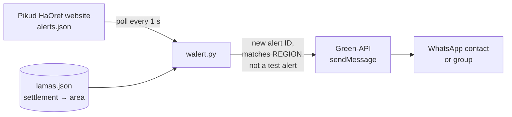

# WAlert

[](https://hub.docker.com/r/techblog/walert)
[](LICENSE)

A WhatsApp bot that forwards Israeli Home Front Command (Pikud HaOref) "Red Alert" notifications
to a WhatsApp chat or group through [Green-API](https://green-api.com/).

WAlert is a small Python service. It polls the public alerts feed on the
[Pikud HaOref website](https://www.oref.org.il/) once per second. When a new alert appears, it
groups the affected settlements by area and sends one formatted message to a single WhatsApp
contact or group. You can watch every alert or a single settlement, and you can drop the
periodic test alerts.

> [!WARNING]
> **Unofficial project. Not a life-safety system.**
> WAlert is not affiliated with, endorsed by, or connected to Pikud HaOref (the Home Front
> Command) or the IDF. Messages can arrive late, arrive incomplete, or never arrive: for
> example, when the website feed, your network, Green-API, WhatsApp or this bot fails.
> **Never depend on it for your safety.** Always rely on the official Home Front Command
> app, the official website, and the sirens.

## Table of contents

- [Features](#features)
- [How it works](#how-it-works)
- [Requirements](#requirements)
- [Installation](#installation)
- [Configuration](#configuration)
- [Usage](#usage)
- [Troubleshooting](#troubleshooting)
- [Security notes](#security-notes)
- [Development](#development)
- [Contributing](#contributing)
- [License](#license)

## Features

- Polls the Pikud HaOref alerts feed (`alerts.json`) every second.
- Sends each new alert to one WhatsApp contact or group through Green-API, using the
  [`whatsapp-api-client-python`](https://pypi.org/project/whatsapp-api-client-python/) library.
- Groups the affected settlements by area, based on the bundled `lamas.json` data file.
- Optional filter: all alerts (`REGION=*`) or only alerts that include one settlement.
- Skips periodic test alerts (`בדיקה` / `בדיקה מחזורית`) unless you turn them on.
- Sends each alert ID only once while the process runs.
- Multi-arch Docker image (`linux/amd64`, `linux/arm64`, `linux/arm/v7`) on Docker Hub.

## How it works



1. **Startup.** WAlert loads `lamas.json` from the working directory. If the file is missing or
   invalid, it downloads a copy from the
   [idodov/RedAlert](https://github.com/idodov/RedAlert) repository and saves it locally.
2. **Polling.** Every second it requests
   `https://www.oref.org.il/WarningMessages/alert/alerts.json`, sending the same `Referer` and
   `X-Requested-With` headers as the website. An empty response means no active alert.
3. **Filtering.** An alert is forwarded when all of these are true:
   - `REGION` is `*`, or `REGION` exactly matches one of the settlement names in the alert.
   - Its `id` has not been sent before in this process.
   - It is not a test alert (unless `INCLUDE_TEST_ALERTS` is `True`).
4. **Formatting and sending.** The settlements are grouped by area using `lamas.json`, and the
   message is sent with Green-API's `sendMessage` to `WHATSAPP_NUMBER`.

### Message format

The alert title is shown in bold, followed by the affected settlements grouped by area
(WhatsApp `*bold*` markup):

```text
*<alert title>*
באזורים הבאים:
 *ישובי <area>*:
<settlement>
<settlement>
*ישובי <another area>*:
<settlement>
```

Settlements that are not found in `lamas.json` are left out of the message.

## Requirements

- A [Green-API](https://green-api.com/) instance (instance ID and API token) linked to a
  WhatsApp account.
- Network access to `www.oref.org.il`. The Pikud HaOref website may restrict access from
  outside Israel, so run WAlert from a location where the feed is reachable.
- Docker (recommended), **or** Python 3 with `pip` to run from source. The Docker image uses
  Ubuntu 20.04 and its system Python 3.
  <!-- TODO: verify the minimum Python version supported by whatsapp-api-client-python -->

## Installation

The image is published on Docker Hub as
[`techblog/walert`](https://hub.docker.com/r/techblog/walert).

### Docker Compose

```yaml
services:
  walert:
    image: techblog/walert:latest
    container_name: walert
    restart: always
    environment:
      - DEBUG_MODE=False
      - REGION=*
      - INCLUDE_TEST_ALERTS=False
      - GREEN_API_INSTANCE=your_green_api_instance_id
      - GREEN_API_TOKEN=your_green_api_token
      - WHATSAPP_NUMBER=972500000000@c.us
```

```bash
docker compose up -d
```

> [!NOTE]
> The `docker-compose.yaml` file in this repository contains placeholder values, not a
> working configuration. Use the example above as a starting point.

### Docker run

```bash
docker run -d \
    --name walert \
    --restart always \
    -e DEBUG_MODE="False" \
    -e REGION="*" \
    -e INCLUDE_TEST_ALERTS="False" \
    -e GREEN_API_INSTANCE="your_green_api_instance_id" \
    -e GREEN_API_TOKEN="your_green_api_token" \
    -e WHATSAPP_NUMBER="972500000000@c.us" \
    techblog/walert:latest
```

### From source

```bash
git clone https://github.com/t0mer/WAlert.git
cd WAlert
python3 -m venv .venv && .venv/bin/pip install -r requirements.txt

export DEBUG_MODE=False
export REGION='*'
export INCLUDE_TEST_ALERTS=False
export GREEN_API_INSTANCE=your_green_api_instance_id
export GREEN_API_TOKEN=your_green_api_token
export WHATSAPP_NUMBER=972500000000@c.us

cd app            # lamas.json is read from the current working directory
../.venv/bin/python walert.py
```

WAlert reads its settings only from environment variables. It does not load a `.env` file by
itself.

A virtual environment is used because many current distributions block system-wide `pip`
installs (PEP 668).

### As a systemd service (optional)

Create the virtual environment as shown in [From source](#from-source). Then put the variables
in an environment file outside the repository checkout, for example `/etc/walert/walert.env`,
so it can never be committed by accident:

```ini
DEBUG_MODE=False
REGION=*
INCLUDE_TEST_ALERTS=False
GREEN_API_INSTANCE=your_green_api_instance_id
GREEN_API_TOKEN=your_green_api_token
WHATSAPP_NUMBER=972500000000@c.us
```

Then create `/etc/systemd/system/walert.service`:

```ini
[Unit]
Description=WAlert - WhatsApp bot for Red Alert alarms
After=network-online.target
Wants=network-online.target

[Service]
User=your-username
WorkingDirectory=/path/to/WAlert/app
EnvironmentFile=/etc/walert/walert.env
ExecStart=/path/to/WAlert/.venv/bin/python /path/to/WAlert/app/walert.py
Restart=always
RestartSec=5

[Install]
WantedBy=multi-user.target
```

Replace `/path/to/WAlert` and `your-username`, restrict the environment file, and then start the
service:

```bash
sudo chown root:root /etc/walert/walert.env
sudo chmod 600 /etc/walert/walert.env
sudo systemctl daemon-reload
sudo systemctl enable --now walert
sudo systemctl status walert
```

## Configuration

All settings are environment variables. The "Image default" column shows the value set in the
`Dockerfile`. When you run from source, the variable is unset unless you set it.

| Variable | Image default | Description |
|---|---|---|
| `REGION` | `*` | `*` forwards every alert. Any other value forwards only alerts whose settlement list contains this exact name, written as in the Pikud HaOref feed (Hebrew). One settlement only. **Required when running from source**: the bot fails at startup if it is unset. |
| `INCLUDE_TEST_ALERTS` | `False` | Test alerts are skipped only when the value is exactly `False`. Any other value, or unset, forwards test alerts too. |
| `GREEN_API_INSTANCE` | *(empty)* | Green-API instance ID. |
| `GREEN_API_TOKEN` | *(empty)* | Green-API instance API token. If this or `GREEN_API_INSTANCE` is empty, alerts are only logged and no message is sent. |
| `WHATSAPP_NUMBER` | *(empty)* | Target chat ID, passed to Green-API as is. For a contact use the international number without `+` followed by `@c.us` (for example `972500000000@c.us`). For a group use the group ID ending in `@g.us`. |
| `DEBUG_MODE` | `False` | When exactly `True`, the bot polls `http://localhost/alerts.json` instead of the Pikud HaOref website. Use it with a local web server that serves a sample `alerts.json` for testing. |

Values are case-sensitive: use `True` and `False`, not `true` and `false`.

## Usage

- Start the container or service and check the log. On startup you should see
  `Monitoring alerts for :<REGION>` and `Lamas data loaded from local file`.
- Each forwarded alert is also written to the log.
- To check your Green-API setup without waiting for a real alert, run with `DEBUG_MODE=True`
  and serve a sample `alerts.json` on `http://localhost/alerts.json` (with Docker, the
  container must be able to reach it as `localhost`, for example with `--network host`). The
  sample needs the same fields as the real feed: `id`, `title` and `data` (a list of
  settlement names).
- See the [Green-API documentation](https://green-api.com/en/docs/) for how to find chat and
  group IDs.

## Troubleshooting

| Symptom | Likely cause |
|---|---|
| Startup error mentioning `str` and `NoneType` | `REGION` is not set. Set it to `*` or a settlement name. |
| Alerts appear in the log but no WhatsApp message arrives | `GREEN_API_INSTANCE` or `GREEN_API_TOKEN` is empty, the token is wrong, or `WHATSAPP_NUMBER` is not a valid chat ID (missing the `@c.us` / `@g.us` suffix). WAlert does not check the `sendMessage` response, so errors returned by Green-API are **not** logged: check the Green-API console for failed requests. `Error sending whatsapp message` appears in the log only when the call raises an exception, such as a network error. |
| Nothing is ever forwarded | The feed is unreachable from your location or network, or `REGION` does not exactly match the settlement name used in the feed. |
| Some settlements are missing from the message | They are not listed in `lamas.json`. Only settlements found there are included. |
| `Lamas data file not found` at startup | The bot was not started from the `app/` directory. It then tries to download `lamas.json` from GitHub. |
| Crash at startup (`argument of type 'NoneType' is not iterable`) after a Lamas download error in the log | `lamas.json` is missing or invalid and the download from GitHub failed, so the bot has no settlement data and stops. Start it from the `app/` directory, or make sure GitHub is reachable. |
| The same alert is sent again after a restart | Sent alert IDs are kept in memory only and are cleared on restart. |

## Security notes

- Treat the Green-API instance ID and token as secrets. Anyone who has them can send
  WhatsApp messages from your account. Keep them out of Git, pass them as environment
  variables or an environment file with restricted permissions, and rotate the token if it
  leaks.
- WAlert opens no ports and needs only outbound HTTPS.
- Keep the image up to date and rebuild it from time to time to pick up base-image fixes.
- Use a dedicated WhatsApp number for the Green-API instance where possible.

## Development

Project layout:

```text
app/walert.py        # the bot (polling, filtering, formatting, sending)
app/lamas.json       # settlement → area mapping used for message grouping
Dockerfile           # Ubuntu 20.04 + Python 3 image, runs app/walert.py
docker-compose.yaml  # compose template (placeholder values)
requirements.txt     # urllib3, loguru, requests, whatsapp-api-client-python
VERSION              # image version tag used by the Docker workflow
.github/workflows/docker-image.yml
```

Build the image locally:

```bash
docker build -t walert:dev .
```

The **Docker Build** GitHub Actions workflow is started manually (or after a workflow named
"Create Release" completes). It builds `linux/amd64`, `linux/arm64` and `linux/arm/v7` images
and pushes `techblog/walert:latest` and `techblog/walert:<VERSION>`, where `<VERSION>` is read
from the `VERSION` file.

The `lamas.json` data comes from the
[idodov/RedAlert](https://github.com/idodov/RedAlert) project.

## Contributing

Issues and pull requests are welcome. Please keep changes focused, describe how you tested
them, and never include real Green-API credentials or phone numbers in commits, issues or
logs.

## License

Licensed under the [Apache License 2.0](LICENSE).
